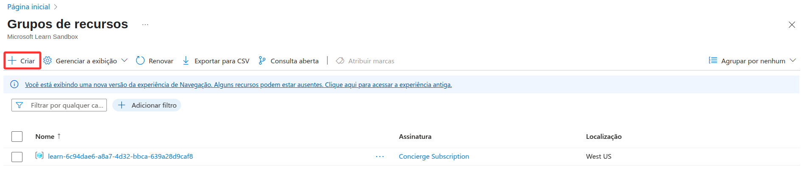
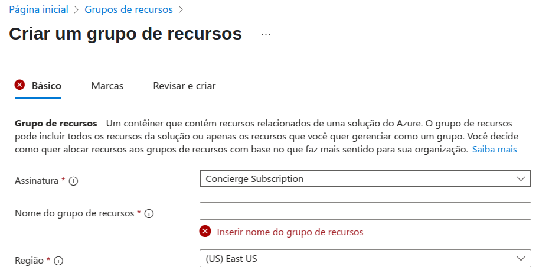
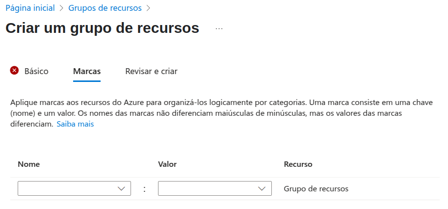

# Construindo arquiteturas no Azure

## Grupo de recursos

Grupos de recursos são contêineres lógicos que agrupam recursos(banco de dados, máquinas virtuais, redes virtuais, etc) relacionados de acordo com determinados critérios em comum para trazer uma maior organização e com isso auxiliar no gerenciamento conjunto e execução de operações em todos eles. Estando em um grupo de recursos, os recursos compartilham o mesmo ciclo de vida, permissões e políticas.

Pontos importantes:

- Um recurso só pode existir em apenas um grupo de recursos por vez.
- Os recursos podem ser movidos para outro grupo de recursos.
- Os grupos de recursos não podem ser aninhados.

### Criação de um grupo de recursos

1-Acesse o portal do Microsoft Azure.

2-Busque pelo serviço nomeado de “Grupos de Recursos”, que pode ser encontrado na página inicial ou no painel de serviços.

3-Selecione o botão “Criar” para abrir o menu de criação do grupo de recursos.

4-Na guia “Básico” selecione uma assinatura.

5-Escolha um nome para o grupo de recursos.

6-Defina uma região.

7-Opcionalmente, é possível aplicar marcações aos grupos de recursos na guia “Marca”.

8-Após determinar as opções de criação, clique no botão “Revisar e criar” ou na guia de mesmo nome e no botão “Criar”.
